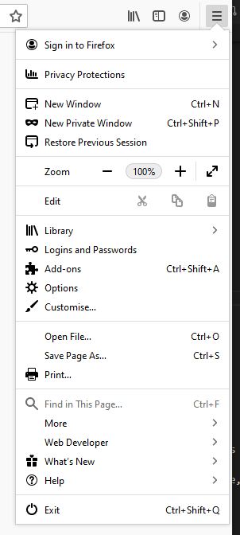
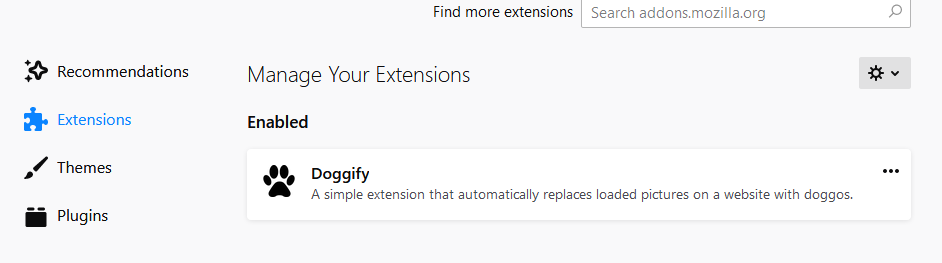
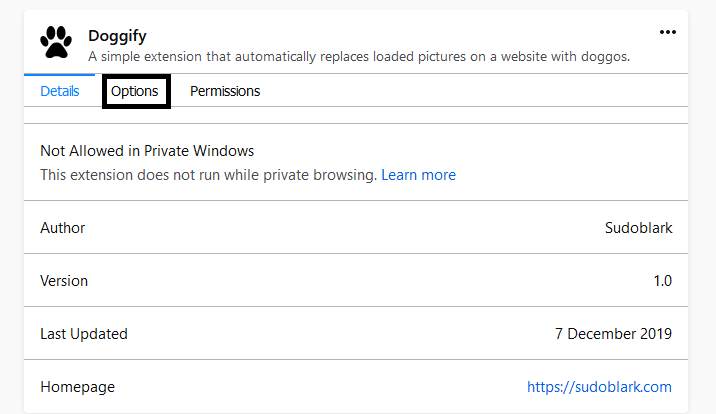
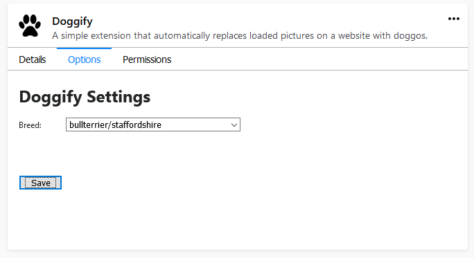
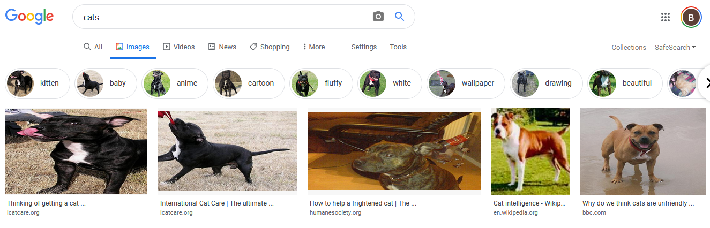

# Doggify

This is an extension for firefox that will let you:
- Automatically replace all images on a webpage with doggos
- Change your preference for what breed of doggo is displayed via an addon settings menu

It does this by:
- Querying the dog-ceo-api for doggos
- Finding all images loaded on a page
- Replacing all of their src with urls returned from the dog-ceo-api

Note: The query to dog-ceo-api changes depending on your preferred breed as set in the addon settings menu

## Overview
Say for example someone is searching for some nasty cades on google images. Normally, they would see something similar to this:


But once this extension is installed all we see are lovely doggos!


## Settings
The settings page of the plugin allows you to:
- Choose what breed of doggo you want displayed

### Choose breed of doggo
- First access the Doggify extension in Firefox by navigating "addons > extensions"



- You will then see the "Doggify" extension:



- Select the "Options" tab to see the "Settings" menu



- Choose your preferred doggo breed then select "Save"



- Refresh any pages and you'll only see doggos from your preferred breed:



## Future Plans
- Every x seconds search the current webpage for non-doggo images and replace them, this will ensure dynamically loaded cades are replaced with doggos
- Add functionality to allow user to right click and image and "doggify" it
- Expanded settings menu to allow you to turn off/on automatic replacement and option to doggify a single image

## Setup Checklist

Simply add the extension in Firefox: https://addons.mozilla.org/en-GB/firefox/addon/doggify/

## Development/Debugging
- Download repo
- Open the [about:debugging](https://developer.mozilla.org/en-US/docs/Tools/about:debugging) page in Firefox
- Navigate to the repo and select the ```manifest.json``` file
- Select "Inspect" to see the web console for the settings page
- Continous doggos loads via a content script injected onto the page, so first you'll need to open a web console on that page and then refresh to see the console

Note: Adding an extension via the method above only adds it for that session of Firefox; if you close then start Firefox again the Doggify extension will not be loaded.

Any changes you make to existing files should update automatically on a refresh, although sometimes you'll need to close and open Firefox again.

## Compatibility
- The iteration of images HTMLCollection is done via the following syntax:

```js
for (let image of imagecollection ) {
    // stuff
}
```

- HTMLCollection seems to be compatible on most modern browsers: https://developer.mozilla.org/en-US/docs/Web/API/HTMLCollection
- Let seems to also be compatible on most modern browser, with IE needing to be at least version 11: https://developer.mozilla.org/en-US/docs/Web/JavaScript/Reference/Statements/let


## Acknowledgements
Icon by [Freepik](https://www.flaticon.com/authors/freepik) from [Flaticon](www.flaticon.com)

Uses the [dog-ceo-api](https://dog.ceo/dog-api/) by [ElliottLandsborough](https://github.com/ElliottLandsborough) with the source code in this [repo](https://github.com/ElliottLandsborough/dog-ceo-api)

## Contributing
Pull requests are welcome. For major changes, please open an issue first to discuss what you would like to change.
