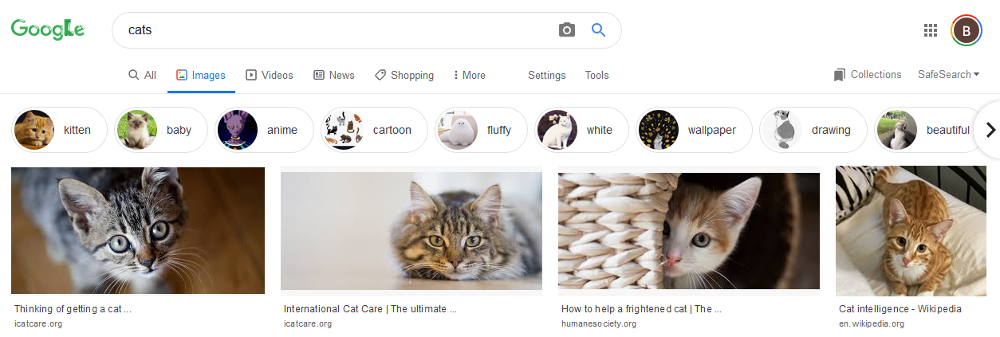
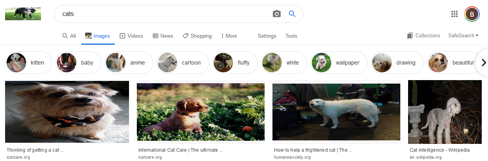

# Doggify

This is just a silly little extension for Firefox that will replace all images on a web-page with that of random dogs.

It does this by:
- Querying the dog-ceo-api for doggos
- Finding all images loaded on a page
- Replacing all of their src with urls returned from the dog-ceo-api

## Overview
Say for example someone is searching for some nasty cades on google images. Normally, they would see something similar to this:



But once this extension is installed all we see are lovely doggos!



## Settings
The settings page of the plugin allows you to:
- Turn off/on continous replacement of images with doggos
- Turn off/on the ability to right click and convert one image to a doggo
- Choose what breed of doggo you want displayed

# Future Plans
- Every x seconds search the current webpage for non-doggo images and replace them, this will ensure dynamically loaded cades are replaced with doggos
- Extension settings menu that allows you to specify what breed of doggo you want to see, as defined by https://dog.ceo/dog-api/breeds-list

# Setup Checklist

Simply add the extension in Firefox#

# Compatibility
- The iteration of images HTMLCollection is done via the following syntax:

```js
for (let image of imagecollection ) {
    // stuff
}
```

- HTMLCollection seems to be compatible on most modern browsers: https://developer.mozilla.org/en-US/docs/Web/API/HTMLCollection
- Let seems to also be compatible on most modern browser, with IE needing to be at least version 11: https://developer.mozilla.org/en-US/docs/Web/JavaScript/Reference/Statements/let


# Acknowledgements
Icon by [Freepik](https://www.flaticon.com/authors/freepik) from [Flaticon](www.flaticon.com)

Uses the [dog-ceo-api](https://dog.ceo/dog-api/) by [ElliottLandsborough](https://github.com/ElliottLandsborough) with the source code in this [repo](https://github.com/ElliottLandsborough/dog-ceo-api)

## Contributing
Pull requests are welcome. For major changes, please open an issue first to discuss what you would like to change.
