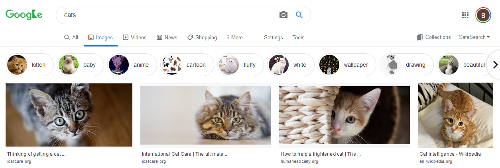
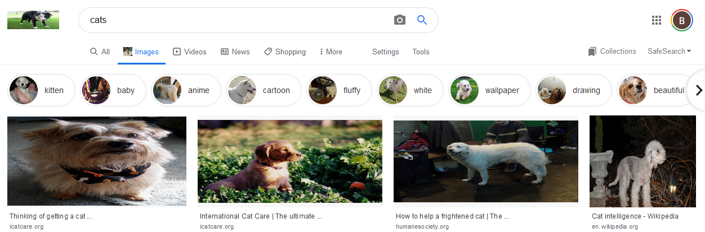
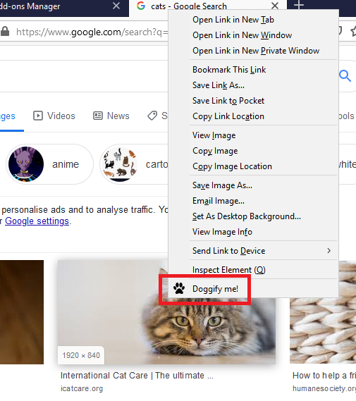
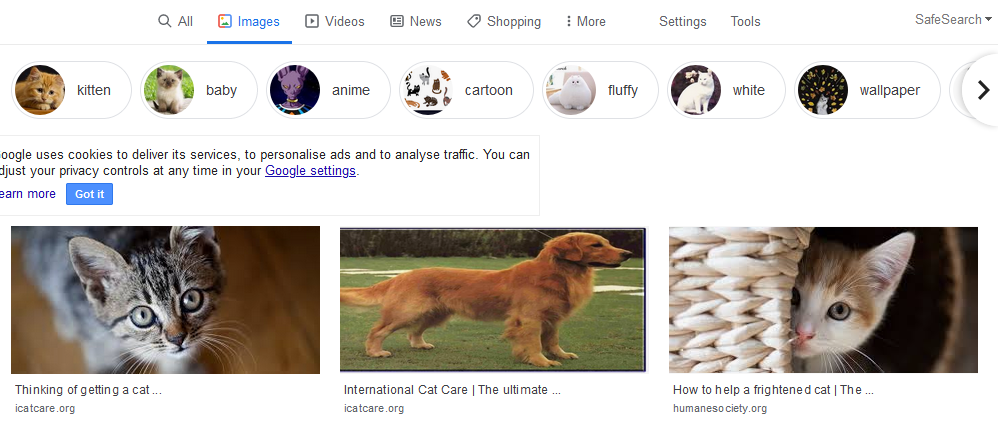
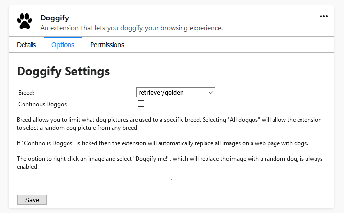

# Doggify
[](https://github.com/Sudoblark/Doggify-Firefox/releases)

[](https://addons.mozilla.org/en-GB/firefox/addon/doggify/)

This is an extension for firefox that will let you:
- Automatically replace all images on a webpage with doggos
- Change your preference for what breed of doggo is displayed via an addon settings menu
- Right click an image and doggify it

You can turn off the automatic replacement of images in the extension's settings menu.

Check it out [here](https://addons.mozilla.org/en-GB/firefox/addon/doggify/) on Firefox!

Click [here](https://sudoblark.github.io/Doggify-Firefox/) for the Github page!

## Acknowledgements
Icon by [Freepik](https://www.flaticon.com/authors/freepik) from [Flaticon](www.flaticon.com)

Uses the [dog-ceo-api](https://dog.ceo/dog-api/) by [ElliottLandsborough](https://github.com/ElliottLandsborough) with the source code in this [repo](https://github.com/ElliottLandsborough/dog-ceo-api)


## Overview
### Continous Doggos
When enabled the plugin will automatically replace all images on a webpage with dogs. 

It will check for pictures not populated by the extension every second, and replace them with dog pictures.

Say for example someone is searching for some nasty cades on google images. Normally, they would see something similar to this:



But once this extension is installed all we see are lovely doggos!



### Doggify an image
This extension extends the Firefox context menu to include a "Doggify me!" option whenever clicking on an image:



If you select this option then the image in question will be changed to a doggo.




## Settings
This can be accessed in firefox by going to "options > addons > extensions > doggify > options".



Remember to "save" when you make changes to the settings menu!

## Future Plans
- Dynamically resize dog image 

## Setup Checklist

Simply add the extension in Firefox: https://addons.mozilla.org/en-GB/firefox/addon/doggify/

## Development/Debugging
- Download repo
- Open the [about:debugging](https://developer.mozilla.org/en-US/docs/Tools/about:debugging) page in Firefox
- Navigate to the repo and select the ```manifest.json``` file
- Select "Inspect" to see the web console for the settings page

Note: Adding an extension via the method above only adds it for that session of Firefox; if you close then start Firefox again the Doggify extension will not be loaded.

Any changes you make to existing files should update automatically on a page refresh, although sometimes you'll need to close and open Firefox again.

### Extension Anatomy

[beautiful-doggos](beautiful.doggos.js) is the content script injected into webpages that:
- First replaces all images with dogs if continous doggos is enabled
- Sets up a timer to replace all non-dog images every second is continous doggos is enabled
- Listens for requests from the background script

[background](background.js) is the background script, it will:
- Create the "Doggify me!" context menu
- Sends messages to the content script on context menu click

The [icons](icons) folder contains icons for the entire extension to consumed by the manifest and context menu items

The [settings](settings) folder contains [HTML](settings/settings.html)/[CSS](settings/settings.css)/[JS](settings/settings.js) relating to the settings page displayed to the user via addons > extensions > Doggify > options. It uses ```browser.storage.sync.set``` to set preferences, whilst the background script uses ``` browser.storage.sync.get``` to get these preferences.

## Compatibility
- The iteration of images HTMLCollection is done via the following syntax:

```js
for (let image of imagecollection ) {
    // stuff
}
```

- HTMLCollection seems to be compatible on most modern browsers: https://developer.mozilla.org/en-US/docs/Web/API/HTMLCollection
- Let seems to also be compatible on most modern browser, with IE needing to be at least version 11: https://developer.mozilla.org/en-US/docs/Web/JavaScript/Reference/Statements/let

## Contributing
Pull requests are welcome. For major changes, please open an issue first to discuss what you would like to change.
